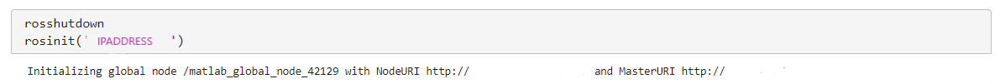
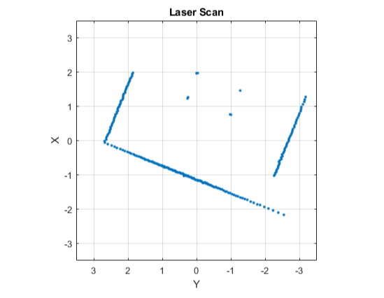
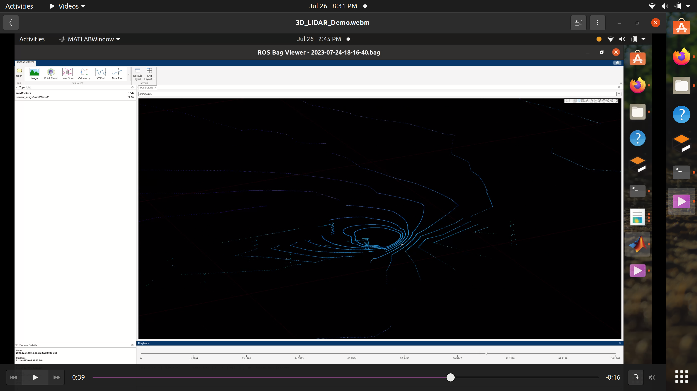
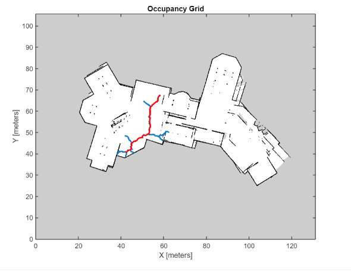
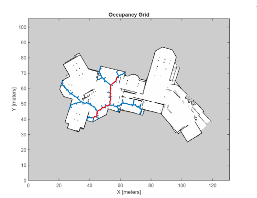
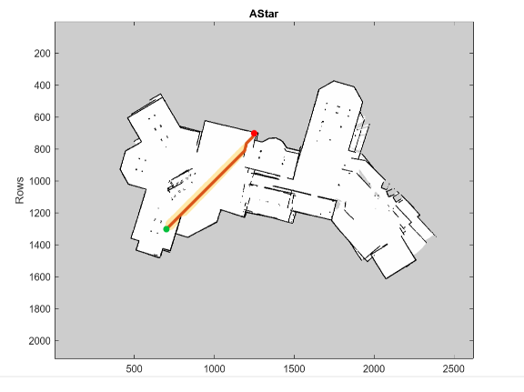
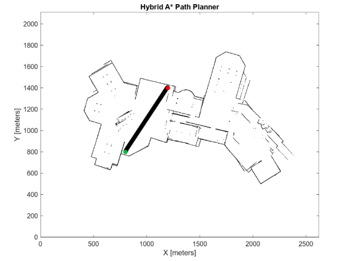
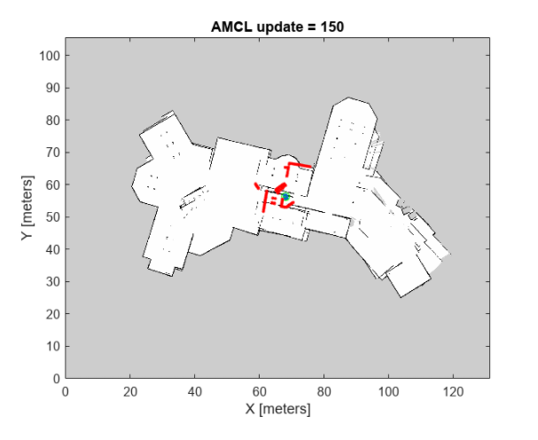

# MATLAB
This project involves using Mathworks softwares for implementing a robust and efficient rough terrain navigation system using the Navigation, Robotics System, Image Processing, Automated Driving and ROS Toolbox in MATLAB. This project aims to enable autonomous robots to navigate challenging terrains, such as rocky surfaces, uneven landscapes, and rugged environments.

## Installation:
1. Install Matlab R2022b - [MATLAB INSTALLATION](https://in.mathworks.com/downloads/)  
   While installing MATLAB, ensure that you install the following toolboxes: 
   a. Robotics System Toolbox 
   b. ROS Toolbox 
   c. Navigation Toolbox 
   d. Automated Driving Toolbox 
   e. Image Processing(Optional) 

2. Install ROS Noetic on your Ubuntu system - [ROS INSTALLATION](http://wiki.ros.org/noetic/Installation/Ubuntu).

## Features :
1. *Co-Simulation* - Setting up ROS-MATLAB co-simulation as a link for data transfer between the two.  
2. *Visualisation* -  Visually depicting the data received from sensors like 2D & 3D Lidar, depth cameras etc. 
3. *Global Path Planners* - Implemented various path planners like RRT, RRT* and Hybrid A*.  
4. *Localisation* - Applied Adaptive Monte Carlo Localization, a particle filter-based approach to estimate the robot's initial pose. 
5. *Motion Planning* - Developed a Simulink Model, which exploits the laser scan topic and /cmd_vel topic to move the bot along the given waypoints and demonstrate obstacle avoidance. 

## Co-simulation of ROS-MATLAB :
ROS MATLAB co-simulation enables seamless integration between MATLAB and ROS (Robot Operating System), facilitating real-time data exchange, control, and visualization, making it a powerful combination for developing and testing complex robotic systems and algorithms.

  
  
.

1. To perform Co-simulation, type in the IP address of the Linux system where you plan on running the Gazebo simulation files. 
2. If there are no errors in connection, the script proceeds to completion. 

## Visualisation :
MATLAB was used to receive sensor data from the Gazebo bot. This data was later visualised to enhance understanding. 
*2D Lidar*

  
  
.

*3D Lidar*

  
  
.

*rosbag file was recorded in the linux system and ROSbagfile viewer app(R2023a) was used to visualise the recorded data*

## Global Path Planners :
After thorough experimentation with various path planners, including RRT, RRT*, A*, and Hybrid A*, we present the results of our tests. 

_The occupancy map of the gazebo world is to be made from .pgm file. Refer to [2D Occupancy Map](https://in.mathworks.com/help/nav/ref/occupancymap.html?searchHighlight=occupancy%20map%202d&s_tid=srchtitle_support_results_1_occupancy%2520map%25202d)_ 

*RRT* 
RRT (Rapidly-exploring Random Trees) Global Path Planner is a popular algorithm used in robotics and motion planning to efficiently search and construct feasible paths in complex, high-dimensional environments. 

  
  
.

*RRT** 
RRT* (Rapidly-exploring Random Trees Star) Global Path Planner is an enhanced version of the RRT algorithm that optimizes the paths it generates by iteratively rewiring the tree, resulting in higher-quality and more optimal paths in complex environments. 

  
  
.

*A** 
A* (A-star) Global Path Planner is a widely-used graph-searching algorithm that efficiently finds the shortest path from a start to a goal node, combining the advantages of both Dijkstra's algorithm and heuristics to ensure optimality and speed in various applications, including robotics and game development. 

  
  
.

*Hybrid A** 
Hybrid A* Global Path Planner is an extension of the traditional A* algorithm that combines grid-based and sampling-based methods, allowing it to efficiently find feasible and smooth paths for autonomous vehicles in continuous state spaces, making it suitable for real-world navigation scenarios. 

  
  
.

## Localisation :
AMCL (Adaptive Monte Carlo Localization) is a probabilistic localization algorithm widely used in robotics and autonomous systems to accurately estimate the pose (position and orientation) of a robot within its environment, utilizing a particle filter approach that dynamically adjusts the number of particles to adapt to changing uncertainties.

  
  
.

## Motion Planning :
The simulink Model interfaces with a Robot Operating System (ROS) environment, receiving odometry and laser scan data. The model incorporates waypoints generated by path planners, enabling the robot to follow the desired path while implementing obstacle avoidance strategies, resulting in safe and efficient navigation through the environment.

## Matlab Scripts :
*1. Path planners :*  
      AstarPlanner.mlx 
      RRTPlanner.mlx 
      RRTstarPlanner.mlx 
      HybridAstarplanner.mlx 

*2. Transformations :* 
      AccessTF.mlx 

*3. Localisation :* 
      MonteCarlo.mlx 

*4. Motion Planning :* 
      PathFollowingWithObstacleAvoidanceInSimulink.mlx
