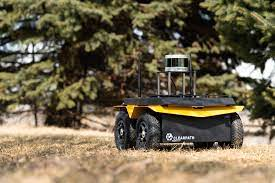
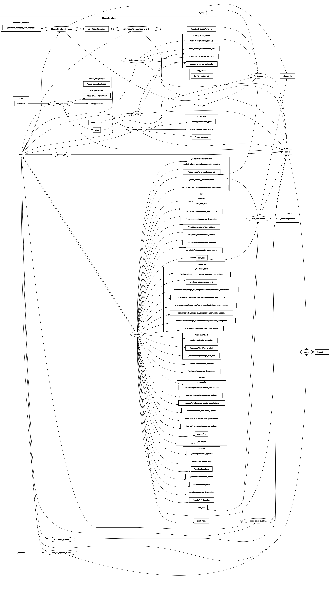

# Autonomous Navigation for Vehicles in Rough Terrain
<!-- Improved compatibility of back to top link: See: https://github.com/othneildrew/Best-README-Template/pull/73 -->
<a name="readme-top"></a>
<!--
*** Thanks for checking out the Best-README-Template. If you have a suggestion
*** that would make this better, please fork the repo and create a pull request
*** or simply open an issue with the tag "enhancement".
*** Don't forget to give the project a star!
*** Thanks again! Now go create something AMAZING! :D
-->


<!-- PROJECT SHIELDS -->
<!--
*** I'm using markdown "reference style" links for readability.
*** Reference links are enclosed in brackets [ ] instead of parentheses ( ).
*** See the bottom of this document for the declaration of the reference variables
*** for contributors-url, forks-url, etc. This is an optional, concise syntax you may use.
*** https://www.markdownguide.org/basic-syntax/#reference-style-links
-->
[![Contributors][contributors-shield]][contributors-url]
[![Forks][forks-shield]][forks-url]
[![Stargazers][stars-shield]][stars-url]
[![Issues][issues-shield]][issues-url]


<div style="display: flex; align-items: center;">
  
  <p>.</p>
</div>


<!-- TABLE OF CONTENTS -->
<details>
  <summary>Table of Contents</summary>
  <ol>
    <li>
      <a href="#about-the-project">About The Project</a>
      <ul>
        <li><a href="#built-with">Built With</a></li>
      </ul>
    </li>
    <li>
      <a href="#getting-started">Getting Started</a>
      <ul>
        <li><a href="#prerequisites">Prerequisites</a></li>
        <li><a href="#installation">Installation</a></li>
      </ul>
    </li>
    <li><a href="#usage">Usage</a></li>
    <li><a href="#roadmap">Roadmap</a></li>
    <li><a href="#contributing">Contributing</a></li>
    <li><a href="#license">License</a></li>
    <li><a href="#contact">Contact</a></li>
    <li><a href="#acknowledgments">Acknowledgments</a></li>
  </ol>
</details>


<!-- ABOUT THE PROJECT -->
## About The Project

Welcome to the ROS-MATLAB project on Rough Terrain Navigation! In this project, we demonstrate how to achieve robust and efficient navigation for mobile robots in challenging terrains using MATLAB toolboxes and co-simulation with Gazebo. Navigating rough terrains is challenging due to uneven surfaces and obstacles. Autonomous systems use advanced algorithms and sensor data to adapt, plan optimised routes, and avoid hazards, making rough terrain navigation easier and more efficient. Jackal, TurtleBot, and Curiosity Mars Rover are the bots utilised for testing. Among them, the Jackal bot exhibited the best results.

Contributors :  
- [Abhishek Nair](https://github.com/NairAbhishek1403)
- [Aditya Suwalka](https://github.com/git-suwalkaaditya)
- [Tejal Uplenchwar](https://github.com/Tejallll)


<p align="right">(<a href="#readme-top">back to top</a>)</p>

### Built With
* 

* 
* 
* 
* 
* 
* 


<p align="right">(<a href="#readme-top">back to top</a>)</p>

## Robots Descrption:
Our experimentation involved utilizing three distinct robots, each deployed in different environments, to thoroughly test the effectiveness of our algorithms. Each robot was equipped with specific sensors, enabling them to navigate and interact with their respective environments efficiently. Below, we provide a description of each robot, along with the sensors they were equipped with:

1. **JACKAL**:
   - Environment: Office World, Inspection World
   - Sensors:
      1. Sick LMS1xx - 2D Laser Scanner
      2. Velodyne VLP-16 - 3D Laser Scanner
      3. Hokuyo UST-10 lidar - front accessory fender
      4. NovAtel satellite navigation receiver
      5. Pointgrey Flea3 camera
      6. Pointgrey Bumblebee2 camera
      7. realsense2_camera

2. **Curiosity Mars Rover**:
   - Environment: Rough Mars terrain world, Flat Shapes world
   - Sensors:
      1. Mast Camera
      2. RearHaz Camera
      3. FrontHaz Camera
      4. Nav Camera
      5. IMU

3. **Turtlebot3 Waffle**:
   - Environment: office world, turtlebot3_world
   - Sensors:
      1. 360 LiDAR

By using a diverse set of robots and environments, we aimed to thoroughly assess the capabilities and limitations of our algorithms, ensuring robustness and adaptability in real-world scenarios. The data collected from these experiments provided valuable insights and helped us refine and optimize our algorithms for better performance and broader applicability.


<!-- GETTING STARTED -->
## Getting Started
For optimal performance, we recommend using two separate systems: one with a Linux OS for installing ROS1 and Gazebo for robotics aspects, and another with Windows OS for MATLAB and its toolboxes. Running all these resource-intensive software on one system may lead to performance issues.

Please refer to the detailed installation instructions provided in the the README files of each folder of our repository to install all the required dependencies and softwares. Follow the instructions carefully to set up each component accordingly.


<!-- USAGE EXAMPLES -->
## Demo and Usage:
 
<p align="right">(<a href="#top">back to top</a>)</p>
1. Setup the required bot by following the steps in the respective directory.
2. Mount the required sensors on the bot.
   eg -
   
```
   export JACKAL_URDF_EXTRAS=$HOME/Desktop/realsense.urdf.xacro
```
3. Launch the required world file and the gmapping algorithm.
   eg -
    
```
   roslaunch cpr_inspection_gazebo inspection_world.launch 
   roslaunch jackal_viz view_robot.launch
   roslaunch jackal_navigation gmapping_demo.launch 
```
   
4. Create and download the .pgm file of the map of the world.
5. Open Matlab Scripts and establish the connection between the two systems to set up co-simulation.
6. Run the .mlx files in order to view the results


<!-- ROADMAP -->
## Roadmap
- [x] Implemented and tested various global path planners like RRT, RRT*, A* and Hybrid A*.
- [x] Added sensors to the bot and received data from ROS using matlab toolboxes.
- [x] Created map using sensor data.
- [x] Implemented AMCL using matlab scripting.
- [x] WayPoint Navigation using Simulink Model.
- [x] Visualisation of pointcloud2 data from Velodyne LiDAR.

## RQT GRAPH
<div style="display: flex; align-items: center;">
  
  <p>.</p>
</div>

## FUTURE IMPLEMENTATION
1. Implementing dynamic obstacle avoidance.
2. Enhance mapping of rough terrain.
3. Changing the existing control system of the bots
4. Using the concept of reinforcement learning.


<!-- CONTRIBUTING -->
## Contributing

Contributions are what make the open source community such an amazing place to learn, inspire, and create. Any contributions you make are **greatly appreciated**.

If you have a suggestion that would make this better, please fork the repo and create a pull request. You can also simply open an issue with the tag "enhancement".
Don't forget to give the project a star! Thanks again!

1. Fork the Project
2. Create your Feature Branch (`git checkout -b feature/AmazingFeature`)
3. Commit your Changes (`git commit -m 'Add some AmazingFeature'`)
4. Push to the Branch (`git push origin feature/AmazingFeature`)
5. Open a Pull Request

<p align="right">(<a href="#readme-top">back to top</a>)</p>


<!-- CONTACT -->
## Contact

**Abhishek Nair:**
[](https://www.linkedin.com/in/abhishek-nair-990a02238/)
[](https://github.com/NairAbhishek1403)
[](mailto:me210003005@iiti.ac.in)

**Aditya Suwalka:**
[](https://www.linkedin.com/in/aditya-suwalka-8975b4243/)
[](https://github.com/git-suwalkaaditya)
[](mailto:me210003008@iiti.ac.in)

**Tejal Uplenchwar:**
[](https://www.linkedin.com/in/tejal-uplenchwar-a93a31226)
[](https://github.com/Tejallll)
[](mailto:me210003078@iiti.ac.in)


<!-- MARKDOWN LINKS & IMAGES -->
<!-- https://www.markdownguide.org/basic-syntax/#reference-style-links -->
[contributors-shield]: https://img.shields.io/github/contributors/github_username/repo_name.svg?style=for-the-badge
[contributors-url]: https://github.com/github_username/repo_name/graphs/contributors
[forks-shield]: https://img.shields.io/github/forks/github_username/repo_name.svg?style=for-the-badge
[forks-url]: https://github.com/github_username/repo_name/network/members
[stars-shield]: https://img.shields.io/github/stars/github_username/repo_name.svg?style=for-the-badge
[stars-url]: https://github.com/github_username/repo_name/stargazers
[issues-shield]: https://img.shields.io/github/issues/github_username/repo_name.svg?style=for-the-badge
[issues-url]: https://github.com/github_username/repo_name/issues
[license-shield]: https://img.shields.io/github/license/github_username/repo_name.svg?style=for-the-badge
[license-url]: https://github.com/github_username/repo_name/blob/master/LICENSE.txt
[linkedin-shield]: https://img.shields.io/badge/-LinkedIn-black.svg?style=for-the-badge&logo=linkedin&colorB=555
[linkedin-url]: https://linkedin.com/in/linkedin_username
[product-screenshot]: images/screenshot.png
[Next.js]: https://img.shields.io/badge/next.js-000000?style=for-the-badge&logo=nextdotjs&logoColor=white
[Next-url]: https://nextjs.org/
[React.js]: https://img.shields.io/badge/React-20232A?style=for-the-badge&logo=react&logoColor=61DAFB
[React-url]: https://reactjs.org/
[Vue.js]: https://img.shields.io/badge/Vue.js-35495E?style=for-the-badge&logo=vuedotjs&logoColor=4FC08D
[Vue-url]: https://vuejs.org/
[Angular.io]: https://img.shields.io/badge/Angular-DD0031?style=for-the-badge&logo=angular&logoColor=white
[Angular-url]: https://angular.io/
[Svelte.dev]: https://img.shields.io/badge/Svelte-4A4A55?style=for-the-badge&logo=svelte&logoColor=FF3E00
[Svelte-url]: https://svelte.dev/
[Laravel.com]: https://img.shields.io/badge/Laravel-FF2D20?style=for-the-badge&logo=laravel&logoColor=white
[Laravel-url]: https://laravel.com
[Bootstrap.com]: https://img.shields.io/badge/Bootstrap-563D7C?style=for-the-badge&logo=bootstrap&logoColor=white
[Bootstrap-url]: https://getbootstrap.com
[JQuery.com]: https://img.shields.io/badge/jQuery-0769AD?style=for-the-badge&logo=jquery&logoColor=white
[JQuery-url]: https://jquery.com 
