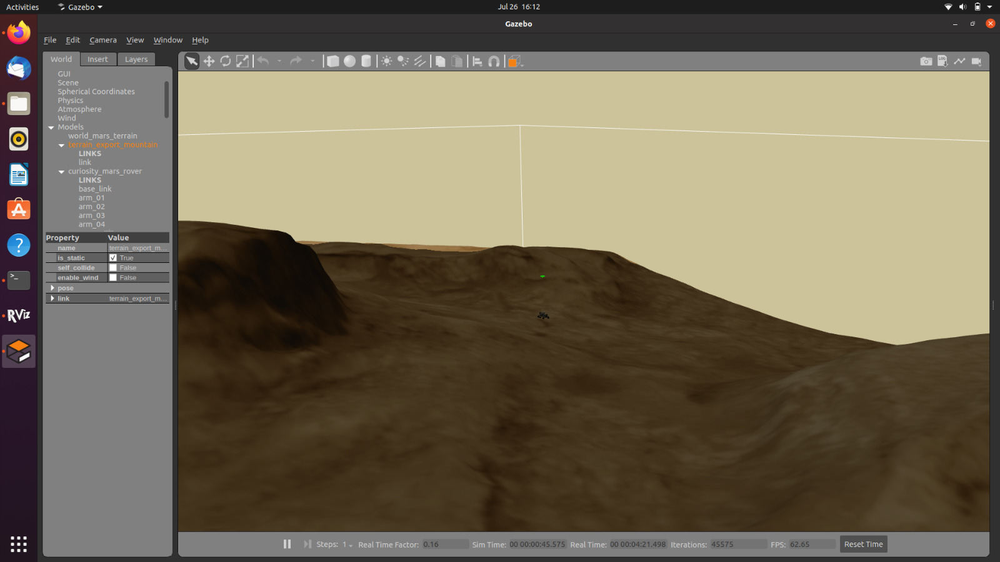
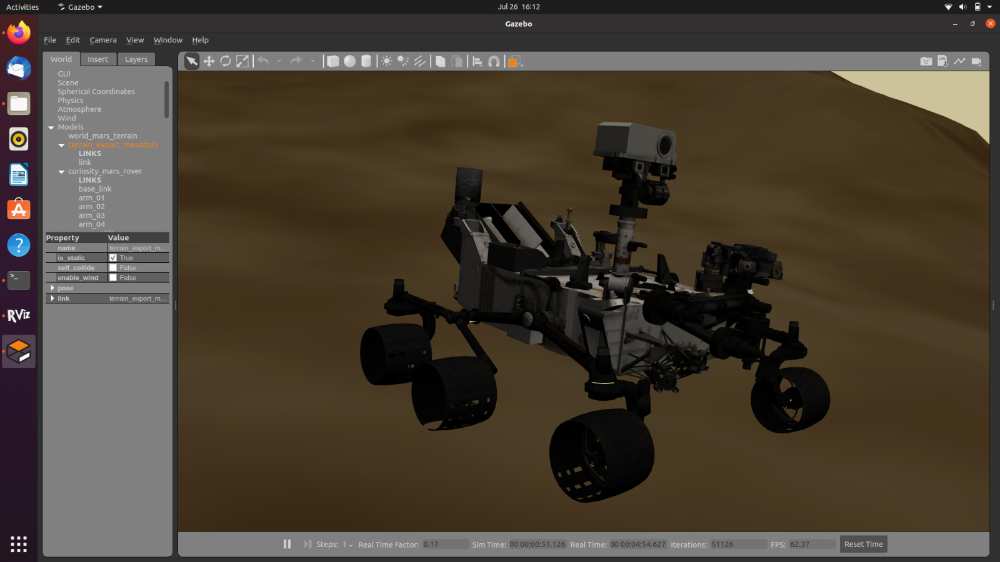
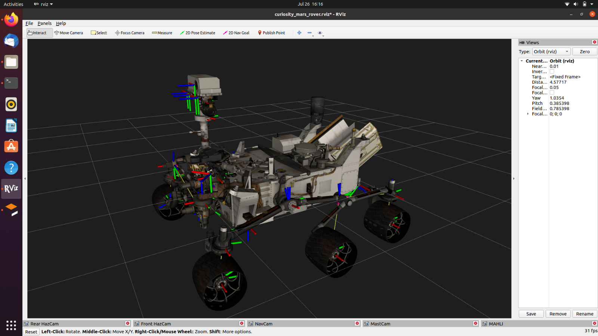
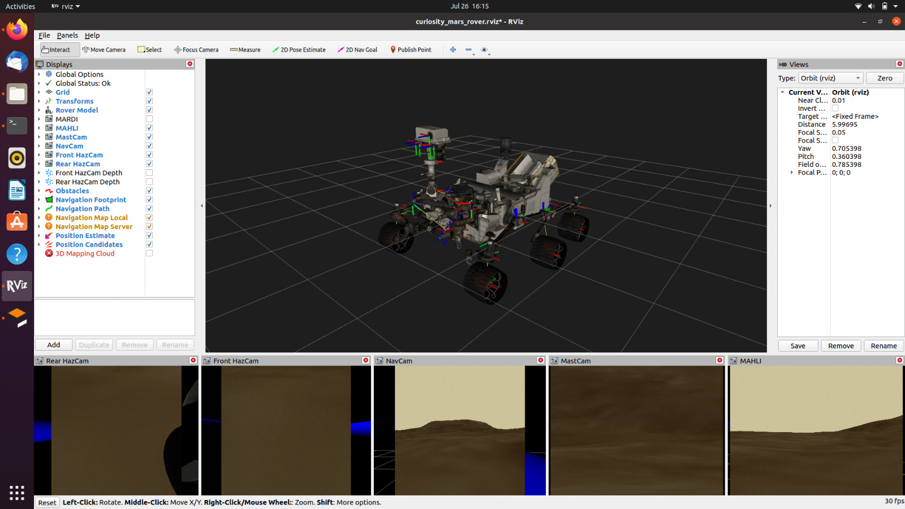

# Curiosity Rover
This is a project inspired by the Mathworks Matlab - Excellence in Innovation Repository :
https://github.com/Autonomousanz/Autonomous-Navigation-in-Rough-Terrain.git

## Description :
The project is an experiment of finding the shortest path to a given set of start and end points namely waypoints using various Path planning algorithms in a rough terrain and then deploying these waypoints on the cu robot. Mainly the tools used were MATLAB for generating the waypoints using a map of the given environment in pgm file and then converting it into occupancyMap or binaryoccupancyMap, further feeding this shortest path to a robot in Gazebo ROS simulation using the Simulink model.

  
  
.

## Installation and Set-Up :
We expanded upon an existing simulation of NASA’s Curiosity rover made for ROS (Robot Operating System) and Gazebo. And enhanced the accuracy of the virtual rover by adding more sensors to Rover.
[Reference Link]([https://markgatland.com/post/2022-curiosity/](https://discourse.ros.org/t/the-nasa-curiosity-rover-rosject-is-now-open-source/7635))

The folder, `curiosity_mars_rover_ws`, is a Catkin workspace. The `src/` folder contains the five ROS packages developed. They are based on the original `curiosity_mars_rover_description` package available from [Here](https://bitbucket.org/theconstructcore/curiosity_mars_rover/src/master/):

 - `curiosity_mars_rover_gazebo`:              Launches a Curiosity Mars rover simulation using the Gazebo simulator as an environment      
 - `curiosity_mars_rover_description`:         Describes the simulated rover using Collada 3D models and URDF descriptions
 - `curiosity_mars_rover_control`:             Enables teleoperation of the rover via command-line interfaces and ROS messages
 - `curiosity_mars_rover_navigation`:          Enables autonomous navigation using the move_base ROS package
 - `curiosity_mars_rover_viz`:                 Launches a web application for visualisation and control of the rover in VR

You will be able to run 'roslaunch' commands, for example:
`roslaunch curiosity_mars_rover_gazebo main_mars_terrain.launch`

  
  
.

  
  
.

  
  
.

