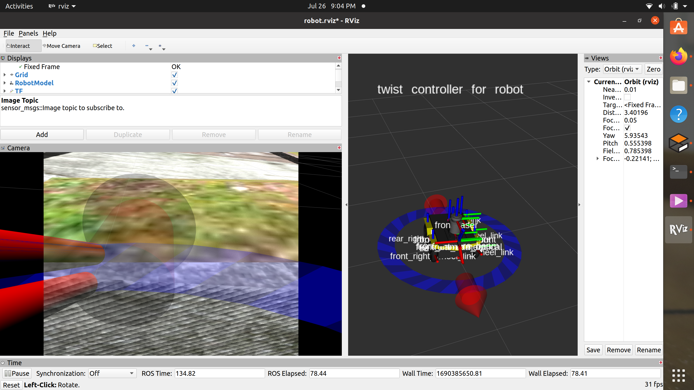
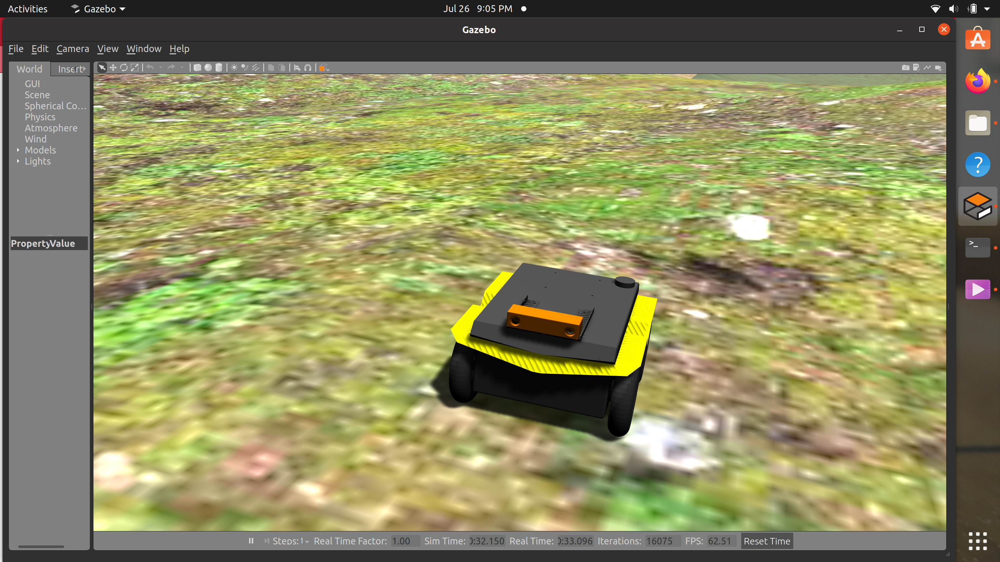

## Jackal
This directory includes all files related to Clearpath Jackal robot including sensor integration, navigation and mapping.  

## Prerequisites:
Firstly, clone this repository.<br>

Type the following commands in the terminal to install the required dependencies:
```
sudo apt-get install ros-noetic-jackal-simulator
sudo apt-get install ros-noetic-jackal-*
sudo apt-get install ros-noetic-velodyne-*
sudo apt-get install ros-noetic-geodesy ros-noetic-pcl-ros ros-noetic-nmea-msgs ros-noetic-libg2o
sudo pip install ProgressBar2
sudo apt-get install ros-noetic-velodyne
sudo apt-get install ros-noetic-velodyne-simulator
sudo apt-get install ros-noetic-geographic-info
sudo apt-get install ros-noetic-robot-localization
sudo apt-get install ros-noetic-twist-mux
sudo apt-get install ros-noetic-pointcloud-to-laserscan
sudo apt-get install ros-noetic-teb-local-planner
rosdep install teb_local_planner
sudo apt-get install ros-noetic-stage-ros
```
<br>

Clone the following repositories 
```
git clone https://github.com/jackal/jackal.git
git clone https://github.com/jackal/jackal_desktop.git
git clone https://github.com/jackal/jackal_simulator.git
git clone https://github.com/OctoMap/octomap_mapping.git
```

Follow the steps to install the worlds
```
git clone https://github.com/clearpathrobotics/cpr_gazebo.git
```

## Sensor Mounting
 Refer to the following link to access various sensors - [Sensors](https://www.clearpathrobotics.com/assets/guides/melodic/jackal/description.html)
 <div style="display: flex; align-items: center;">
  
  <p>.</p>
</div>
<div style="display: flex; align-items: center;">
  
  <p>.</p>
</div>
<div style="display: flex; align-items: center;">
  
  <p>.</p>
</div>
<div style="display: flex; align-items: center;">
  
  <p>.</p>
</div>

## Visualisation
