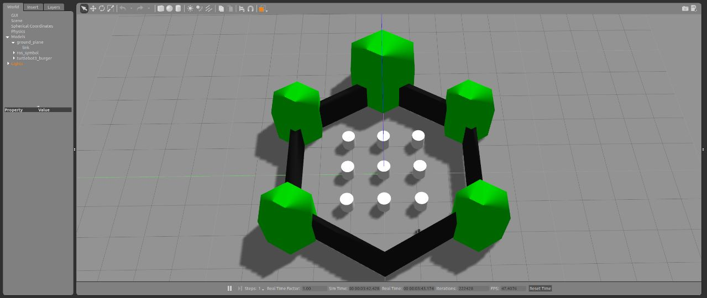
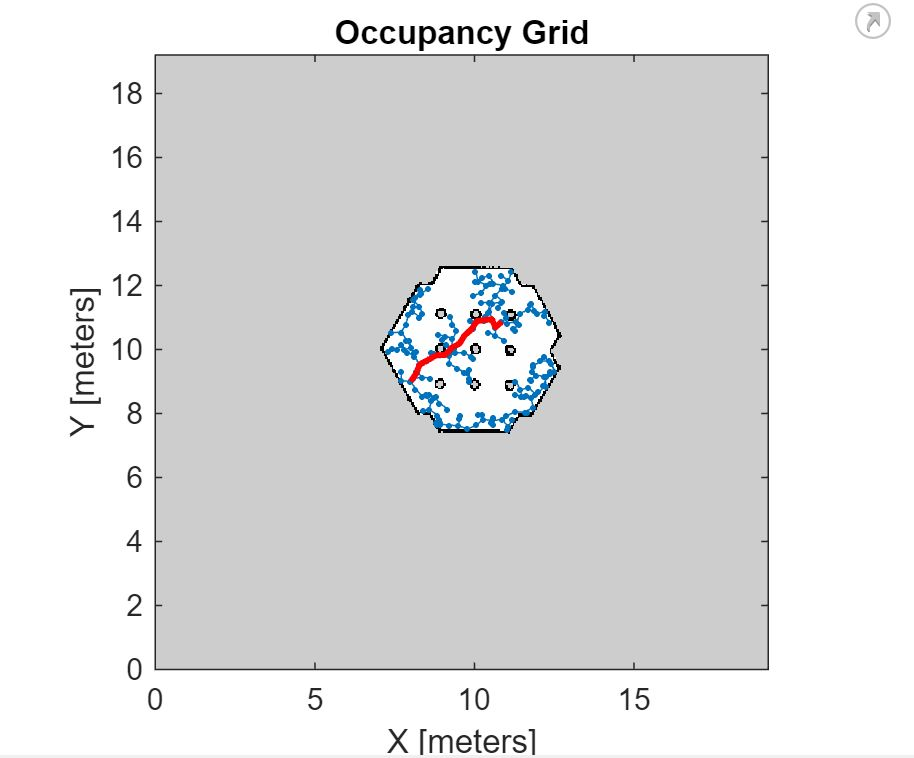
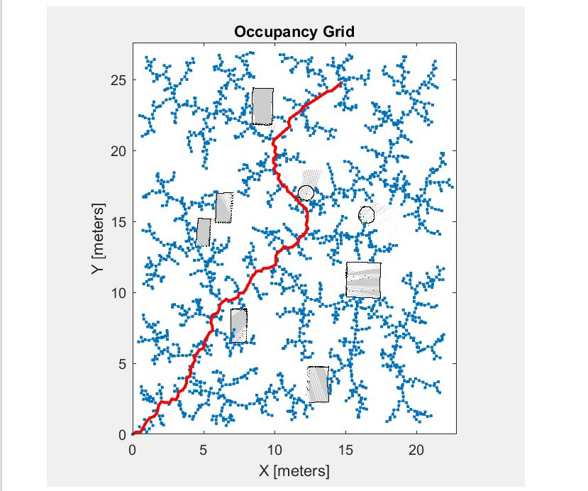

# Turtlebot
This is project inspired from the Mathworks Matlab - Excellence in Innovation Repository :
https://github.com/Autonomousanz/Autonomous-Navigation-in-Rough-Terrain.git
## Installation :
You can install turtlebot by following
[Turtlebot3 Installation Tutorial.](https://emanual.robotis.com/docs/en/platform/turtlebot3/simulation/)

SLAM Simulation
1. Launch Simulation World - 
`$ export TURTLEBOT3_MODEL=burger` 
`$ roslaunch turtlebot3_gazebo turtlebot3_world.launch`: 
3. Run SLAM Node - 
`$ export TURTLEBOT3_MODEL=burger` 
`$ roslaunch turtlebot3_slam turtlebot3_slam.launch slam_methods:=gmapping`
4. Run Teleoperation Node - 
  `$ export TURTLEBOT3_MODEL=burger` 
`$ roslaunch turtlebot3_teleop turtlebot3_teleop_key.launch`
6. Save Map - 
`$ rosrun map_server map_saver -f ~/map`

## Description :
The project is an experiment of finding the shortest path to a given set of start and end points namely waypoints using various Path planning algorithms in a plane terrain and then deploying these waypoints on the turtlebot robot. Mainly the tools used were MATLAB for generating the waypoints using a map of the given environment in pgm file and then converting it into occupancyMap or binaryoccupancyMap, further feeding this shortest path to a robot in Gazebo ROS simulation using the Simulink model.

## Procedure :
Following are the steps taken for running this project -
1. Below is the environment suitable for the application - :

  
  
.

2. Launching the robot in this environment using the launch file which contains the world file location in the catkin workspace. 
`$ export TURTLEBOT3_MODEL=burger` 
`$ roslaunch turtlebot3_gazebo turtlebot3_world.launch`: 
  
3. Generate a pgm file through slam mapping of this environment.

4. Once the pgm file or occupancyMap is available, use a matlab mlx script of the planner that we want to test (A*, RRT planner, RRT* planner, Hybride A*) to generate a path using particular algorithm.

  
  
.

  
  
.

5. Once the waypoints were created, the final point was designated as the goal of the trajectory. This goal point needed to be converted back into Gazebo coordinates. To achieve this, the mathworks path following with obstacle avoidance slx file was employed. This file took the goal point as input and generated the corresponding velocity upon connection with the Gazebo simulation. To establish a connection with the Turtlebot in the Gazebo environment, the command "rosinit" was initialized in the command line of Matlab, which set up the ROS master connection.
6.With everything in place, the robot commenced traversing the given path and aimed to reach the goal set within the Gazebo environment once the Simulink model ran successfully.
